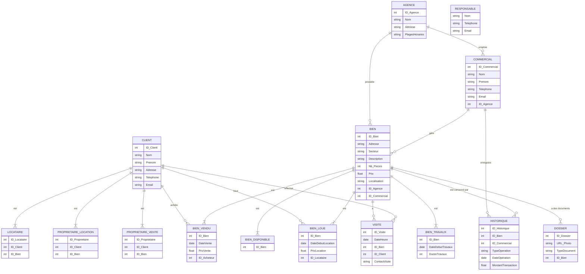

```mermaid
erDiagram
    AGENCE {
        int ID_Agence
        string Nom
        string Adresse
        string PlagesHoraires
    }
    RESPONSABLE {
        string Nom
        string Telephone
        string Email
    }
    COMMERCIAL {
        int ID_Commercial
        string Nom
        string Prenom
        string Telephone
        string Email
        int ID_Agence
    }
    CLIENT {
        int ID_Client
        string Nom
        string Prenom
        string Adresse
        string Telephone
        string Email
    }
    PROPRIETAIRE_VENTE {
        int ID_Proprietaire
        int ID_Client
        int ID_Bien
    }
    PROPRIETAIRE_LOCATION {
        int ID_Proprietaire
        int ID_Client
        int ID_Bien
    }
    LOCATAIRE {
        int ID_Locataire
        int ID_Client
        int ID_Bien
    }
    BIEN {
        int ID_Bien
        string Adresse
        string Secteur
        string Description
        int Nb_Pieces
        float Prix
        string Localisation
        int ID_Agence
        int ID_Commercial
    }
    BIEN_DISPONIBLE {
        int ID_Bien
    }
    BIEN_LOUE {
        int ID_Bien
        date DateDebutLocation
        float PrixLocation
        int ID_Locataire
    }
    BIEN_VENDU {
        int ID_Bien
        date DateVente
        float PrixVente
        int ID_Acheteur
    }
    BIEN_TRAVAUX {
        int ID_Bien
        date DateDebutTravaux
        int DureeTravaux
    }
    VISITE {
        int ID_Visite
        date DateHeure
        int ID_Bien
        int ID_Client
        string ContactVisite
    }
    HISTORIQUE {
        int ID_Historique
        int ID_Bien
        int ID_Commercial
        string TypeOperation
        date DateOperation
        float MontantTransaction
    }
    DOSSIER {
        int ID_Dossier
        string URL_Photo
        string TypeDocument
        int ID_Bien
    }

    AGENCE ||--o{ COMMERCIAL : "emploie"
    AGENCE ||--o{ BIEN : "possède"
    COMMERCIAL ||--o{ BIEN : "gère"
    CLIENT ||--o{ BIEN_LOUE : "loue"
    CLIENT ||--o{ BIEN_VENDU : "achète"
    BIEN ||--o{ VISITE : "a"
    CLIENT ||--o{ VISITE : "effectue"
    COMMERCIAL ||--o{ HISTORIQUE : "enregistre"
    BIEN ||--o{ HISTORIQUE : "est concerné par"
    BIEN ||--o{ DOSSIER : "a des documents"
    
    BIEN ||--|{ BIEN_LOUE : "est"
    BIEN ||--|{ BIEN_VENDU : "est"
    BIEN ||--|{ BIEN_TRAVAUX : "est"
    BIEN ||--|{ BIEN_DISPONIBLE : "est"
    CLIENT ||--|{ PROPRIETAIRE_VENTE : "est"
    CLIENT ||--|{ PROPRIETAIRE_LOCATION : "est"
    CLIENT ||--|{ LOCATAIRE : "est"

```

