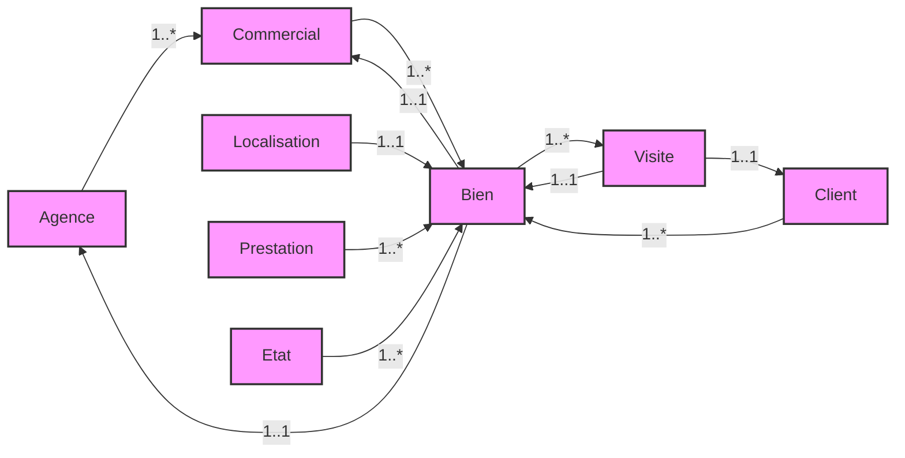

```mermaid
graph LR
    Agence -->|1..*| Commercial
    Commercial -->|1..*| Bien
    Bien -->|1..1| Agence
    Bien -->|1..1| Commercial
    Client -->|1..*| Bien
    Bien -->|1..*| Visite
    Visite -->|1..1| Bien
    Visite -->|1..1| Client
    Localisation -->|1..1| Bien
    Prestation -->|1..*| Bien
    Etat -->|1..*| Bien

    classDef default fill:#f9f,stroke:#333,stroke-width:2px
    classDef entity fill:#f9f,stroke:#333,stroke-width:2px
    classDef relation fill:#ccc,stroke:#333,stroke-width:2px

    class Agence entity
    class Commercial entity
    class Bien entity
    class Client entity
    class Visite entity
    class Localisation entity
    class Prestation entity
    class Etat entity
```
